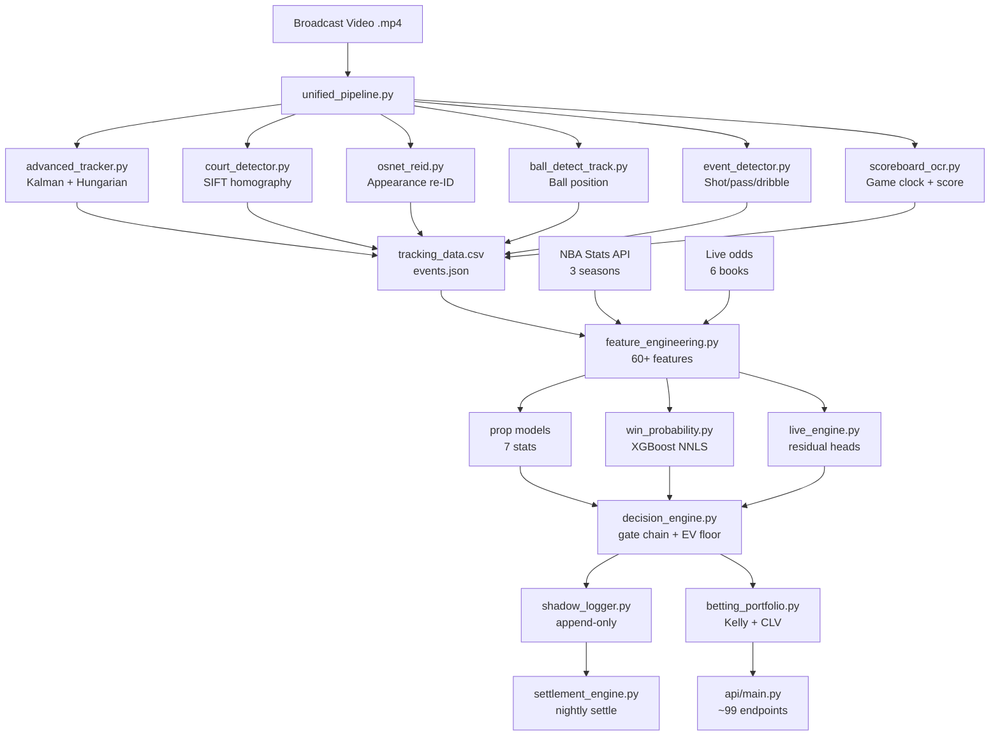

# CourtVision — System Architecture

> End-to-end technical map of the platform. For the recruiter-facing evidence narrative see
> [`docs/JOB_EVIDENCE_PACKET.md`](docs/JOB_EVIDENCE_PACKET.md). For validated metrics see
> [`docs/ML_MODELS.md`](docs/ML_MODELS.md). For the CV pipeline deep-dive see
> [`docs/CV_TRACKING.md`](docs/CV_TRACKING.md). For the API surface see
> [`docs/API.md`](docs/API.md).

---

## The Funnel

Everything in the system flows through one directed pipeline:

```
DATA → SIGNALS → MODELS → ENGINES → PREDICTIONS → INTELLIGENCE
```

Each stage refines the one above it. Nothing downstream can compensate for a
broken upstream stage — the system is deliberately auditable at each boundary.

| Stage | What it does | Key modules |
|-------|--------------|-------------|
| **DATA** | Broadcast video → court coords; NBA Stats API; live lines from 6 books | `src/pipeline/unified_pipeline.py`, `src/data/` |
| **SIGNALS** | 60+ spatial/temporal CV features + 80-artifact intelligence layer + discovery loop | `src/features/feature_engineering.py`, `src/loop/` |
| **MODELS** | 7 prop heads, win-prob NNLS stack, in-play residual heads, calibration layers | `src/prediction/` |
| **ENGINES** | Possession simulator, de-vig, Kelly sizing, shadow log, decision engine | `src/prediction/betting_portfolio.py`, `src/prediction/decision_engine.py` |
| **PREDICTIONS** | Projections + EV + sized bets, served over FastAPI (~99 endpoints) | `api/` |
| **INTELLIGENCE** | 690-node knowledge graph, player/team dossiers, agentic improvement loop | `src/loop/`, `data/intelligence/` |

---

## Broadcast-CV Pipeline

The CV pipeline is the most structurally distinct component. It converts raw
`.mp4` broadcast footage into per-frame player positions, ball location, and
game events using only a consumer GPU (RTX 4060). Cost: **~$0.10–0.13/game**
vs six-figure commercial tracking systems.

```
Broadcast Video (.mp4)
        │
        │  PyAV/decord frame decode
        │  (async _FramePrefetcher thread overlaps decode with GPU compute)
        ▼
┌───────────────────────────────────────────┐
│  STAGE 1 — Court Homography               │
│  src/pipeline/unified_pipeline.py         │
│  src/tracking/court_detector.py           │
│                                           │
│  • HSV masking → HoughLinesP → line       │
│    intersection → cv2.getPerspectiveTransform  │
│  • Three-tier SIFT acceptance:            │
│    <8 inliers → keep prev M              │
│    8–39 → EMA blend (α=0.3)             │
│    ≥40 → hard reset                      │
│  • EMA smoothing + every-30-frame drift   │
│    re-anchor (alignment < 0.35 → reset)  │
│  • Replay/scene-cut suspension            │
│  Output: 3×3 homography M, pixel → feet  │
└─────────────────┬─────────────────────────┘
                  │
                  ▼
┌───────────────────────────────────────────┐
│  STAGE 2 — Person Detection               │
│  src/tracking/advanced_tracker.py         │
│  (YOLOv8n, custom-trained ball detector) │
│                                           │
│  • YOLOv8n nano (class 0 = person)       │
│    conf ≥ 0.35, input 640×640            │
│  • Separate YOLOv8n fine-tuned ball      │
│    detector: scripts/train_ball_yolo.py  │
│    weights: models/weights/yolov8n_ball  │
│    .{pt,onnx,engine}                     │
│  Output: [x1,y1,x2,y2,conf] per person  │
└─────────────────┬─────────────────────────┘
                  │
                  ▼
┌───────────────────────────────────────────┐
│  STAGE 3 — Multi-Object Tracking          │
│  src/tracking/advanced_tracker.py         │
│  class AdvancedFeetDetector               │
│                                           │
│  Kalman filter (per slot):                │
│    state = [cx, cy, vx, vy, w, h]        │
│    constant-velocity prediction model     │
│                                           │
│  Hungarian assignment:                    │
│    cost[i,j] = 0.75 × (1 − IoU)         │
│              + 0.25 × appearance_dist     │
│    scipy.optimize.linear_sum_assignment  │
│    (lapx/lap used when available for      │
│    ByteTrack-style two-stage assignment)  │
│                                           │
│  Appearance model:                        │
│    Primary: 96-dim L1-norm HSV histogram  │
│    (32 hue bins × 3 sat bins)            │
│    EMA update: α=0.7                      │
│    Gallery TTL: 300 frames                │
│                                           │
│  OSNet re-ID (src/tracking/osnet_reid.py)│
│    Omni-scale network, reimplemented in  │
│    PyTorch with depthwise-sep convolutions│
│    256-dim embeddings                     │
│    Inference: TensorRT → torchreid →     │
│    standalone → MobileNetV2 → HSV hist   │
│    NOTE: ships with ImageNet-pretrained  │
│    weights; production appearance model  │
│    is the HSV histogram                  │
│                                           │
│  Team classification (color_reid.py):    │
│    k-means k=2 on player crops           │
│    similar-color mode: appearance weight │
│    raised 0.25 → 0.35 when hue           │
│    centroids within 20°                  │
└─────────────────┬─────────────────────────┘
                  │
                  ▼
┌───────────────────────────────────────────┐
│  STAGE 4 — Ball Tracking                  │
│  src/tracking/ball_detect_track.py        │
│  class BallDetectTrack                    │
│                                           │
│  Three-tier fallback:                     │
│  T1: YOLOv8n ball detector (primary)     │
│  T2: Hough circles + CSRT tracker        │
│  T3: Lucas-Kanade optical flow           │
│  Possession: ball center ∈ player bbox   │
│  Known issue: ball_valid_pct = 0% on     │
│  some games (under active investigation) │
└─────────────────┬─────────────────────────┘
                  │
                  ▼
┌───────────────────────────────────────────┐
│  STAGE 5 — Event Detection                │
│  src/tracking/event_detector.py           │
│  class EventDetector                      │
│                                           │
│  Shot: ball leaves possessor bbox,        │
│    upward trajectory, parabola fit        │
│  Pass: ball displacement > 200px/frame,  │
│    new possessor assigned                 │
│  Dribble: ball y-coord local minimum     │
│    while same possessor holds ball        │
│  Fallback: last-known possessor coords   │
│    when ball_pos = None                   │
└─────────────────┬─────────────────────────┘
                  │
                  ▼
┌───────────────────────────────────────────┐
│  STAGE 6 — Scoreboard + Jersey OCR        │
│  src/tracking/scoreboard_ocr.py           │
│  src/tracking/jersey_ocr.py               │
│                                           │
│  ScoreboardOCR: EasyOCR (PaddleOCR       │
│    preferred), reads every _OCR_INTERVAL  │
│    frames; outputs game_clock_sec,        │
│    shot_clock, home_score, away_score,   │
│    period, timeouts, fouls               │
│                                           │
│  JerseyOCR: dual-pass (normal + inverted │
│    binary crop); JerseyVotingBuffer      │
│    majority-vote over 3 frames;           │
│    jersey# → NBA API roster → player_id  │
└─────────────────┬─────────────────────────┘
                  │
                  ▼
┌───────────────────────────────────────────┐
│  STAGE 7 — Feature Engineering            │
│  src/features/feature_engineering.py     │
│  src/pipeline/tracking_feature_extractor │
│  .py                                     │
│                                           │
│  60+ features per player per frame:      │
│  Spatial: defender_distance, spacing_     │
│    score (convex hull), paint_density,   │
│    shot_angle                            │
│  Temporal: speed, acceleration,          │
│    fatigue_index (vs player baseline)    │
│  Rolling: shots/passes/dribbles over    │
│    5/10/20-frame windows                 │
│  Physical validity caps + phantom-slot   │
│  filtering + ~10 sentinel-leak guards    │
│  (each guard tied to a specific observed │
│  artifact, Bug 30/31/34/...)            │
└─────────────────┬─────────────────────────┘
                  │
                  ▼
           tracking_data.csv + events.json
```

**Output schema:** per-row fields include `player_id`, `track_id`, `x_court`,
`y_court` (feet, 94×50 plane), `vx`, `vy`, plus all 60+ behavioral features.
Data lands in `data/tracking/tracking_data.csv` and `data/nba_ai.db`
(`cv_features` table: 17,254 rows / 241 games / 252 distinct NBA player IDs).

**Hardware invariants:**
- `_VRAM_FLUSH_INTERVAL = 3000` in `unified_pipeline.py` (not 100 — causes OOM)
- Panorama SIFT ratio: 3–10 (broadcast frames break at the default 2.0)
- `OMP_NUM_THREADS=4` set before any YOLO call
- Always headless (`--no-show`), never `cv2.imshow`

---

## ML + Prediction Stack

```
tracking_data.csv + NBA API
        │
        ▼
src/features/feature_engineering.py
  ├─ CV spatial features (defender_distance, spacing, fatigue)
  ├─ NBA API features (pace, lineup, ref, altitude, travel)
  └─ Market features (Pinnacle no-vig, line velocity, steam flag)
        │
        ▼
Model Stack  (see docs/ML_MODELS.md for full inventory)
  ├─ Tier 1 — PREGAME
  │    ├─ 7 prop models (XGB/LGB/MLP NNLS stack, q50 primary)
  │    │   MAE: PTS ~4.58 | REB ~1.90 | AST ~1.34 | FG3M ~0.88
  │    ├─ Win-prob: 5-way NNLS (XGBoost + logistics)
  │    │   0.709 acc / 0.193 Brier (3-fold walk-forward)
  │    └─ Game-level: total, spread, blowout, pace, first-half
  │
  ├─ Tier 2 — IN-PLAY RESIDUAL LAYER
  │    ├─ Period snapshot heads: endQ1 + endQ2 (SHIPPED)
  │    ├─ Foul-change + blowout-flip + heat-check residuals
  │    ├─ Learned Q4 minute trajectory: minute_trajectory.py
  │    └─ Calibrated live quantile bands (80% empirical coverage)
  │
  └─ Supporting models (xFG Brier 0.226, DNP AUC 0.979, ...)
        │
        ▼
src/prediction/decision_engine.py
  ├─ Gate chain: projection_sane → min_edge → three_book_consensus
  ├─ EV floor (calibrated 0.01→0.12 on shadow log)
  ├─ S/A/B/C tier classification by EV magnitude
  └─ → shadow_logger.py (every eval recorded, incl. blocked bets)
        │
        ▼
src/prediction/betting_portfolio.py
  ├─ Shin (1992) de-vig (stable bisection solver)
  ├─ Fractional Kelly (0.25–0.5) × confidence tier
  ├─ Ledoit-Wolf shrinkage on 7×7 residual covariance
  └─ Drawdown circuit breakers + isotonic win-prob override
        │
        ▼
api/main.py  (~99 endpoints, 12 routers)
  ├─ REST: props, predictions, win-prob, devig, CLV, analytics
  ├─ SSE: /sse/live_edges (cross-book arb stream)
  └─ WebSocket: live win-prob feed
```

**Honest market read:** against real closing lines (DK/FD/MGM), the model is
roughly break-even-minus-vig overall. AST shows a small durable edge (~+4–5%,
breaks in playoffs). The +18.38% ROI figure is retracted — it was a
market-follow grading artifact (see `docs/JOB_EVIDENCE_PACKET.md §4`).

---

## Possession-Level Monte Carlo Engine

```
src/prediction/possession_simulator.py
src/sim/basketball_sim.py (possession MC)
src/sim/sgp_from_sim.py   (SGP pricing)
```

The simulator runs possession-by-possession Monte Carlo (N=10K paths by default).
Key design choices:

- **Shared scoring pie:** offensive players compete for a lineup-conditioned
  scoring allocation sampled from real stint minutes. This causes the correct
  negative teammate correlation (~−0.10) to emerge mechanically — no hand-tuned
  covariance matrix.
- **Defense drives predictions:** defensive team rating adjusts per-possession
  scoring probability.
- **Anchor pinning:** marginal distributions are pinned to box-score pregame
  projections, preventing the simulation from drifting.
- **SGP pricing** (`sgp_from_sim.py`): reads joint samples directly from the
  MC paths, so same-game parlay correlation is priced correctly. A
  `validate_joint_calibration` harness verifies the joint structure.

The codebase explicitly does **not** claim a betting edge from the MC engine.

---

## Two-Arm Self-Improving Loop

The loop is the meta-layer that improves every stage above it automatically.

```
src/loop/
  ├─ orchestrator.py   — drives both arms; checkpoint/resume
  ├─ gate.py           — 5-criterion ship gate (the honest gatekeeper)
  ├─ error_miner.py    — ARM A: mines model residuals → hypotheses
  ├─ discovery.py      — ARM A: LLM-free feature-transform enumerator
  ├─ wiring.py         — ships a signal (GPU retrain + write-back)
  ├─ atlas.py          — ARM B: intelligence atlas section builder
  ├─ intel_validator.py— ARM B: validates atlas sections
  ├─ ledger.py         — append-only audit log
  └─ memory_writer.py  — persists findings to knowledge graph
```

### ARM A — Signal Discovery

```
error_miner.mine()
  └─> Hypothesis queue (FDR-budget-aware, ledger-deduped)
        └─> for each hypothesis:
              Signal.build(as_of_context)   ← leak-safe feature construction
                └─> gate.evaluate(signal)   ← 5-criterion gate (see below)
                      ├─ SHIP        → wiring.ship_signal (GPU retrain + atlas write)
                      ├─ VARIANCE_ONLY → wiring.wire_variance_signal
                      ├─ DEFER (≤3 attempts) → requeue
                      └─ REJECT       → ledger only
```

### ARM B — Intelligence Atlas

```
discover intel/*.py AtlasSection modules
  └─> section.build(as_of_context)
        └─> intel_validator.validate(section)
              └─> profile_factory_bridge.register_section
                    └─> memory_writer.write_finding
                          └─> ledger.record_atlas
```

### The Ship Gate (`src/loop/gate.py`)

The gate evaluates all five criteria jointly. All must pass for `SHIP`;
a point-fail with interval-pass yields `VARIANCE_ONLY`.

| Criterion | Implementation | Threshold |
|-----------|---------------|-----------|
| Walk-forward | Expanding folds; `assert max_train_date < min_test_date` per fold | ALL folds delta_MAE < 0 |
| Null-shuffle | Real delta vs shuffled-label null distribution | z ≥ 3 |
| Ablation vs full | Marginal holdout delta of adding signal to full model | relative eps > 1e-3 |
| Calibration | Reliability/coverage (MAE or Brier per target type) | target-specific |
| CLV | Closing-line value vs Pinnacle | CLV ≥ 0 |
| Multiple comparisons | Benjamini-Hochberg FDR across all tested signals | ledger-wide |
| Held-out budget | One-time test set, spent exactly once per loop lifetime | checkpoint-tracked |

**Most candidates are correctly rejected — that is the design.**

---

## Multi-Sport Platform Direction

Approximately 38% of the codebase is already sport-agnostic: the gate logic,
the walk-forward harness, the Kelly/devig engine, the conformal calibrator, the
shadow logger, and the alerting/daemon layer have no NBA-specific imports. The
remaining 62% couples to NBA API structures.

The planned architecture separates this into:

```
kernel/            ← sport-blind (38% of current code, today)
  ├─ loop/         ← discovery, gate, wiring, ledger
  ├─ prediction/   ← walk_forward, conformal, calibration, Kelly
  └─ serving/      ← FastAPI skeleton, daemons, shadow log

domains/
  └─ nba/          ← today's full NBA system = the reference adapter
  └─ tennis/       ← Phase 0 proof (market-only, no CV)
  └─ <sport>/      ← adding a sport = only the adapter layer
```

Detailed plan: `.planning/platform/` (private). High-level vision: `docs/PLATFORM.md`.

---

## Data Flow (Detailed)



---

## Module Ownership

| Concern | Owner module |
|---------|-------------|
| Pipeline orchestration | `src/pipeline/unified_pipeline.py` |
| Player tracking | `src/tracking/advanced_tracker.py` — `AdvancedFeetDetector` |
| Ball tracking | `src/tracking/ball_detect_track.py` — `BallDetectTrack` |
| Team color re-ID | `src/tracking/color_reid.py` — `TeamColorTracker` |
| Deep re-ID (OSNet) | `src/tracking/osnet_reid.py` — `DeepAppearanceExtractor` |
| Court homography | `src/tracking/court_detector.py` + `unified_pipeline._build_court()` |
| Scoreboard OCR | `src/tracking/scoreboard_ocr.py` — `ScoreboardOCR` |
| Jersey OCR | `src/tracking/jersey_ocr.py` |
| Feature engineering | `src/features/feature_engineering.py` |
| Prop models | `src/prediction/player_props.py` + `prop_model_stack.py` |
| Win probability | `src/prediction/win_probability.py` |
| In-play engine | `src/prediction/live_engine.py` — `project_from_snapshot()` |
| Conformal intervals | `src/prediction/conformal_props.py` — `ConformalPredictor` |
| De-vig | `src/prediction/devig.py` (Shin bisection solver) |
| Kelly sizing + CLV | `src/prediction/betting_portfolio.py` |
| Decision engine | `src/prediction/decision_engine.py` |
| Shadow logging | `src/prediction/shadow_logger.py` |
| Settlement | `src/prediction/settlement_engine.py` |
| Loop orchestration | `src/loop/orchestrator.py` — `Orchestrator` |
| Ship gate | `src/loop/gate.py` — `gate.evaluate()` |
| API serving | `api/main.py` (12 routers included here) |
| Possession MC | `src/prediction/possession_simulator.py` |
| Walk-forward harness | `src/prediction/walk_forward_backtester.py` |

---

## Integration Points

| System | Module | State |
|--------|--------|-------|
| NBA Stats API | `src/data/nba_api_collector.py` | Live (569 gamelogs, 221K shots) |
| The Odds API | `src/data/odds_collector.py` | Live (6 books) |
| Pinnacle CLV | `src/prediction/betting_portfolio.py` | Scaffolded — historical archive starts Oct 2026 |
| Injury feeds | `src/data/injury_collector.py` | Live (ESPN + NBA official) |
| RunPod GPU | `scripts/launch_multigpu.sh` | Operational |
| B2 object storage | `scripts/sync_remote.py` | Active |
| PostgreSQL | `database/schema.sql` | Schema ready, migration pending |
| Sentry | `api/main.py` | Wired (SENTRY_DSN env var) |
| WebSocket feeds | `scripts/draftkings_ws.py`, `fanduel_ws.py`, `betrivers_ws.py` | Gated (DK_WS_ENABLED=1) |

---

## Key Invariants

These constraints are load-bearing. Violating them causes silent failures or OOM crashes.

- `_VRAM_FLUSH_INTERVAL` in `unified_pipeline.py` must be **3000** (not 100)
- Panorama SIFT ratio: **3–10** (broadcast frames fail at the default 2.0)
- `OMP_NUM_THREADS=4` must be set before any YOLO call
- Never run `run.py` or `loop_processor.py`
- Video processing: always headless (`--no-show`), never `cv2.imshow`
- PostgreSQL and CV clusters run in isolated processes — never mix

---

*Related: [`README.md`](README.md) · [`docs/CV_TRACKING.md`](docs/CV_TRACKING.md) · [`docs/ML_MODELS.md`](docs/ML_MODELS.md) · [`docs/API.md`](docs/API.md) · [`docs/JOB_EVIDENCE_PACKET.md`](docs/JOB_EVIDENCE_PACKET.md)*

*Last verified: 2026-06-11*
